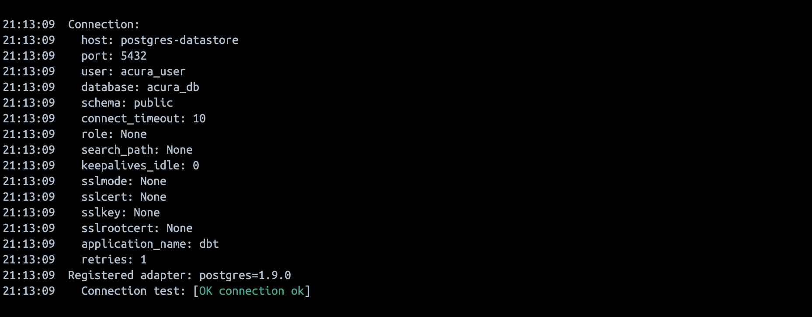

# acura
A containerized user review analytics platform that uses publicly available information about card products to guide feature roadmap planning and identify key areas of focus for business development. 

First, create a dotenv and store the following key in it:

``AIRFLOW_PROJ_DIR=/path/to/this/folder``

Use the environment setup command below in the project root directory (`acura`) to automatically configure and launch all the necessary services:

``docker-compose -f docker-compose.yml -f airflow/docker/docker-compose.airflow.yml up -d``

To shutdown all services, use:

``docker-compose -f docker-compose.yml -f airflow/docker/docker-compose.airflow.yml down --volumes --remove-orphans``

## Components

### Database: Postgres

#### RDBMS service
Configured in `docker-compose.yml` under the service name `postgres-datastore`. To reset the database to its initial (mock data) state, trigger the `reset_data` DAG on the Airflow UI.

#### Adminer GUI
The adminer service runs on `0.0.0.0:8086`.

The username and password are present in the `profiles.yml` configuration file under `dbt_logic/`.

### Orchestration: Airflow
Airflow services are configured together in a `docker-compose.airflow.yml` file under `airflow/docker/` directory; there is also a custom `Dockerfile` that adds `docker compose` CLI utilties used to orchestrate the `dbt` container. The airflow compose configuration is then merged with the main `docker-compose.yml` at execution time of the `docker-compose up` command (see top section of this readme). 

The Airflow webserver runs on `0.0.0.0:8080`. The username and password are present in the `airflow/docker-compose.airflow.yml` file. Once authenticated, filter by the `acura` tag to ignore Airflow example DAGs. 

### Data Transformations: dbt

The dbt service is configured as a container bridged into the same network shared by the remaining services. Data architecture is designed according to the Snowflake Data Cloud Deployment Framework (DCDF) and has the following layers:

1. Source/Cloud: `public` schema
2. Raw layer: `raw` schema
3. Integration layer: `integration` schema
4. Presentation layer: `presentation` schema
5. Share layer: `share` schema

Though the Source and Cloud layers are usually not part of Snwflake (and in this case, Postgres), this project assumes the containers are running as cloud services/microservices and so there is no additional ingress; source data in the `public` schema is referenced by dbt models starting from the `raw` layer.

Please note that due to dbt naming conventions, the prefix `public_` will be attached to all dbt models, due to the configuration of only a development dbt profile. So, for example, the `raw` schema would appear as `public_raw`.

### Data Quality: deequ

### Analytics: Apache Spark

#### EDA using `jupyter-pyspark`
A jupyterlab instance with fully a configured Spark environment is available on a URL in the logs of the `jupyter-pyspark` container:

### Visualization: Grafana
The Grafana visualization service runs on `0.0.0.0:3080`. The default username and password are `admin` and `admin` respectively. 

## Containerization using Docker
### Network (`docker network ls`)
All container services are bound to the same network named `backend`, which resolves to `acura-backend` due to the project name. These services include:
- Postgres: the main Postgres service, adminer
- Airflow: workers, webserver, internal postgres db, internal redis db
- dbt: all transformation operations on the Postgres db

### Containerized task orchestration

The `dbt` image present in the main `docker-compose.yml` is configured with a simple `debug` command. This is simply to show how the container service works, but as a standalone unit it simply accomplishes its command and stops:

This allows for containerized task orchestration - simply spawn a container for each task using the same dbt image, mounting any necessary volumes and adding any environment keys to the `airflow-common` configuration anchors. Airflow's BashOperators can be configured to use the host's Docker socket at `var/run/docker.sock`, which is mirrored and exposed as a service using TCP to ensure safety.

## Source Data
Currently, only mock data is used to simulate real-world collected data.