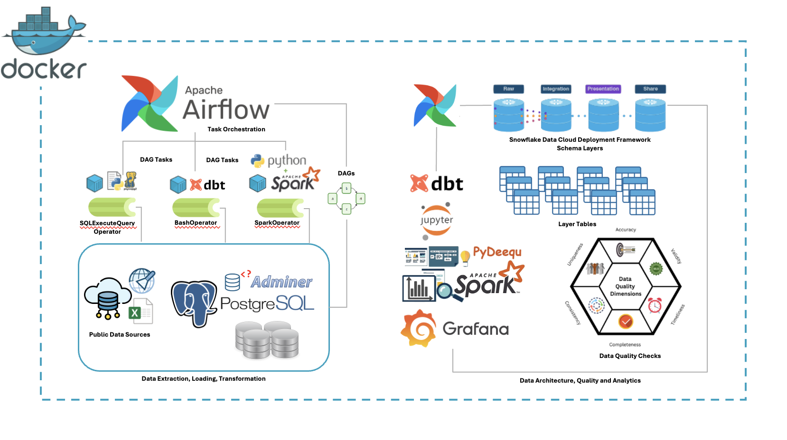
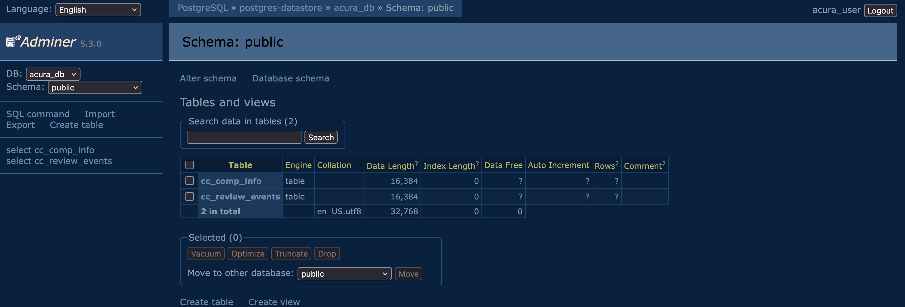
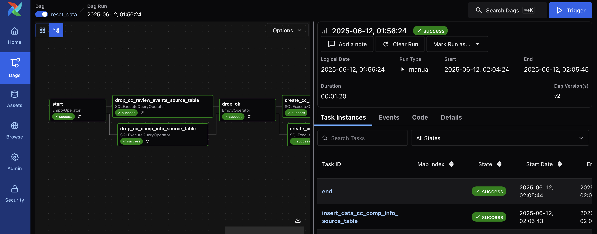
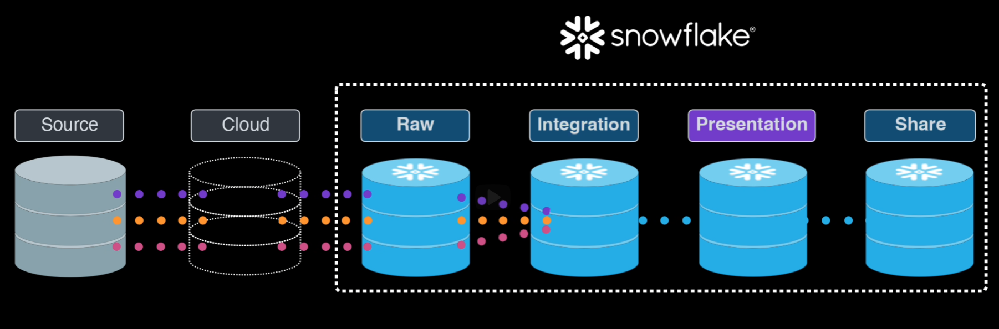
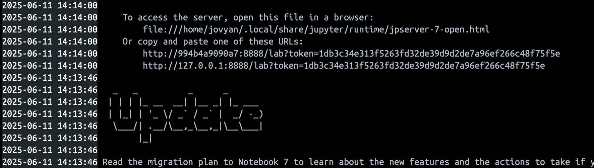
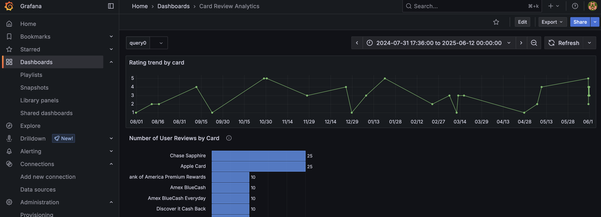
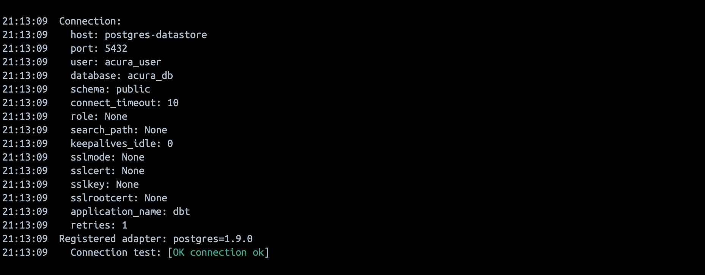

# acura

A containerized user review analytics platform that uses publicly available information about card products to guide feature roadmap planning and identify key areas of focus for business development. 

First, create a dotenv and store the following key in it:

``AIRFLOW_PROJ_DIR=/path/to/this/folder``

Use the environment setup command below in the project root directory (`acura`) to automatically configure and launch all the necessary services:

``docker-compose -f docker-compose.yml -f airflow/docker/docker-compose.airflow.yml up -d``

To shutdown all services, use:

``docker-compose -f docker-compose.yml -f airflow/docker/docker-compose.airflow.yml down``

To 'reset' the containers that have named volume storage (e.g Airflow), use:

``docker-compose -f docker-compose.yml -f airflow/docker/docker-compose.airflow.yml down --volumes --remove-orphans``

**NOTE**: Any containers that depend on named volume storage rather than bind mountsd will lose data. Airflow, for example, will lose its configured connection to the Postgres database. Be sure to recreate the connection on the Airflow UI if using this reset option.

## Components

### Database: Postgres

#### RDBMS service
Configured in `docker-compose.yml` under the service name `postgres-datastore`. To reset the database to its initial (mock data) state, trigger the `reset_data` DAG on the Airflow UI.

#### Adminer GUI
The adminer service runs on [`0.0.0.0:8086`](http://0.0.0.0:8086).

The username and password are present in the `profiles.yml` configuration file under `dbt_logic/`.

### Orchestration: Airflow
Airflow services are configured together in a `docker-compose.airflow.yml` file under the `airflow/docker/` directory; there is also a custom `Dockerfile` that adds `docker compose` CLI utilties used to orchestrate `dbt` containers. The airflow compose configuration is then merged with the main `docker-compose.yml` at execution time of the `docker-compose up` command (see top section of this readme). 

The Airflow webserver runs on [`0.0.0.0:8080`](http://0.0.0.0:8080). The default username and password are `airflow` and `airflow` respectively. Once authenticated, filter by the `acura` tag to ignore Airflow example DAGs. 

### Data Transformations: dbt

The dbt service is configured as a container bridged into the same network shared by the remaining services. Data architecture is modeled after the [Snowflake Data Cloud Deployment Framework (DCDF)](https://quickstarts.snowflake.com/guide/dcdf_incremental_processing/index.html#1) and has the following layers:

1. Source/Cloud: `public` schema. The unaltered, raw data from various EL sources.
2. Raw layer: `raw` schema. A 1:1 replication of the source data with extra control columns eg. `ingest_timestamp`
3. Integration layer: `integration` schema. All "business transformations" and feature engineering
4. Presentation layer: `presentation` schema
5. Share layer: `share` schema

The Source and Cloud layers are usually not part of Snwflake (and in this case, Postgres); this project assumes this portion is already set up under the `public` schema and referenced by dbt models starting from the `raw` layer.

Please note that due to dbt naming conventions, the prefix `public_` will be attached to all dbt models, due to the configuration of only a development dbt profile. So, for example, the `raw` schema would appear as `public_raw`.

### Data Quality: deequ

### Data Analytics: Apache Spark

#### EDA using `jupyter-pyspark`
A jupyterlab instance with fully a configured Spark environment is available on a URL in the logs of the `jupyter-pyspark` container:

## Visualization: Grafana
The Grafana visualization service runs on [`0.0.0.0:3080`](http://0.0.0.0:3080). The default username and password are `admin` and `admin` respectively. 

## Containerization using Docker

### Configuring `docker-compose.yml` and `Dockerfile`s

The two main dockerfiles used in this project are `docker-compose.yml` and `airflow/docker/docker-compose.airflow.yml`. Airflow has its own [template dockerfile](https://airflow.apache.org/docs/apache-airflow/3.0.2/docker-compose.yaml) which has several services already defined within it; keeping the files separate increases readability and keeps the core airflow services together for easy cross-referencing.

The `apache/airflow:3.0.2` image does not contain docker cli tools like `docker compose`, and so a custom `Dockerfile` is specified in the compose directives to install them. If you need to add/modify packages, be sure to rebuild the appropriate service images. For example, if rebuilding the Airflow worker:

``docker-compose -f docker-compose.yml -f airflow/docker/docker-compose.airflow.yml build airflow-worker``

### Network (`docker network ls`)
All container services are bound to the same network named `backend`, which resolves to `acura-backend` due to the project name. These services include:
- **Postgres**: the main Postgres service, adminer
- **Airflow**: workers, webserver, internal postgres and redis databases
- **dbt**: all transformation operations on the Postgres db, documentation service
- **Spark**: master, worker nodes, `jupyter-pyspark` service
- **Grafana**: main Grafana service
- **Other**: Virtual host `docker.sock` service

### Containerized task orchestration

The `dbt` image present in the main `docker-compose.yml` is configured with a `docs generate` command, that runs a documentation site at [`0.0.0.0:707`](http://0.0.0.0:7070)

DBT can be similarly configured to run containerized task orchestration - simply spawn a container for each task using the dbt image, mounting any necessary volumes and adding any environment keys to the `airflow-common` configuration anchors. Airflow's BashOperators can be configured to use the host's Docker socket at `var/run/docker.sock`, which is mirrored and exposed as a service using TCP to ensure safety.

This is simply to show how the container service works, but as a standalone unit it simply accomplishes its command and stops:

